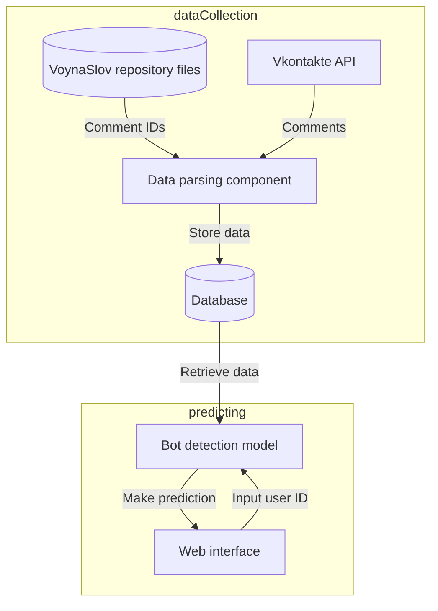

# Malicious Bot Detection


Detection of malicious bots spreading propaganda on Russian social media during the Russian-Ukrainian armed conflict 2022.

This project is part of the Computer Science Master's thesis at the University of Passau and HSE University.

## Coding principles
Based on [Transforming Code into Scientific Contributions](https://www.frontiersin.org/articles/10.3389/fninf.2017.00069/full#:~:text=Scientific%20code%20is%20different%20from,are%20often%20overlooked%20in%20practice.). 
### Re-runnable
- [x] All dependencies and their exact versions are documented in the requirements.txt file.
- [x] The code runs in a [Docker](https://hub.docker.com/_/python/) container.

### Reproducible
- [x] All the data and code used in this project should be placed in this repository for easy future distribution.

### Reusable
- [ ] The code should contain sufficient comments and documentation in order to be reusable. 
- [x] Type hinting is to be used throughout the code for clarity.

### Replicable
- [ ] A clear description of the algorithms used should be publicly available.

## Flowchart


## How to set up the project

### Environment variables

Place an `.env` file in the root folder of the project and insert the following values:
```
COMMENT_ID_SOURCE_REPO=chan0park/VoynaSlov
GITHUB_ACCESS_TOKEN=...
LOG_LEVEL=INFO
VK_API_TOKEN=...
MONGO_DB_PASSWORD=...
WEB_SECRET=...
```

### SentiStrength
The `sentistrength` folder should contain the `SentiStrength.jar` file and `SentiStrength_Data_RU` folder. How to get both? See the (SentiStrength website)[http://sentistrength.wlv.ac.uk/] and contact Prof. Michael Thelwall at M.Thelwall@wlv.ac.uk. 

### Docker
```commandline
docker build -t bot-detection .
docker run bot-detection
```

### Babel
```commandline
pybabel extract -F babel.cfg -o messages.pot templates/*
pybabel update -i messages.pot -d translations
pybabel compile -d translations
```

### Run the web app
```commandline
gunicorn app:app
```
