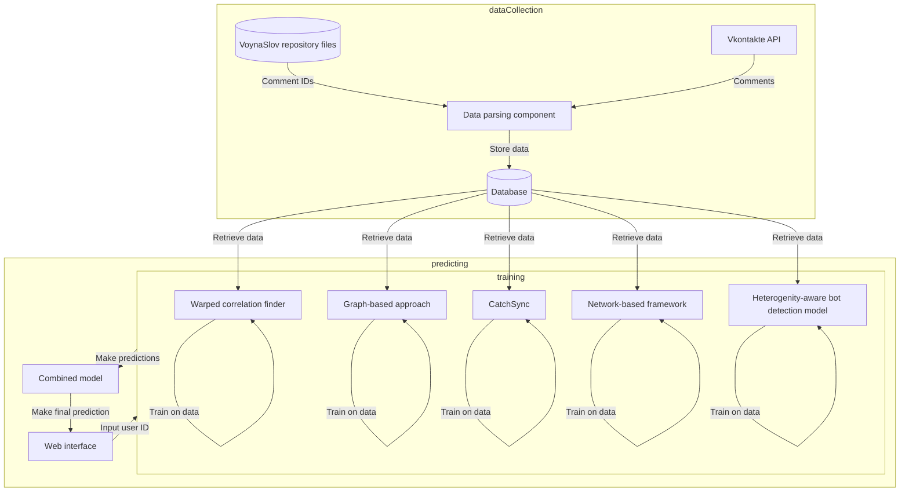

# Malicious Bot Detection
Detection of malicious bots spreading propaganda on Russian social media during the Russian-Ukrainian armed conflict 2022.

This project is part of the Computer Science Master's thesis at the University of Passau.

## Coding principles
Based on [Transforming Code into Scientific Contributions](https://www.frontiersin.org/articles/10.3389/fninf.2017.00069/full#:~:text=Scientific%20code%20is%20different%20from,are%20often%20overlooked%20in%20practice.). 
### Re-runnable
1. All dependencies and their exact versions are documented in the requirements.txt file.
2. The code runs in a Docker container.

### Repeatable
1. The code should be covered by tests ensuring stable repeatable results.
2. The tests should be integrated into the CI pipeline.

### Reproducible
1. All the data and code used in this project should be placed in this repository for easy future distribution.

### Reusable
1. The code should contain sufficient comments and documentation in order to be reusable.

### Replicable
1. A clear description of the algorithms used should be publicly available.

